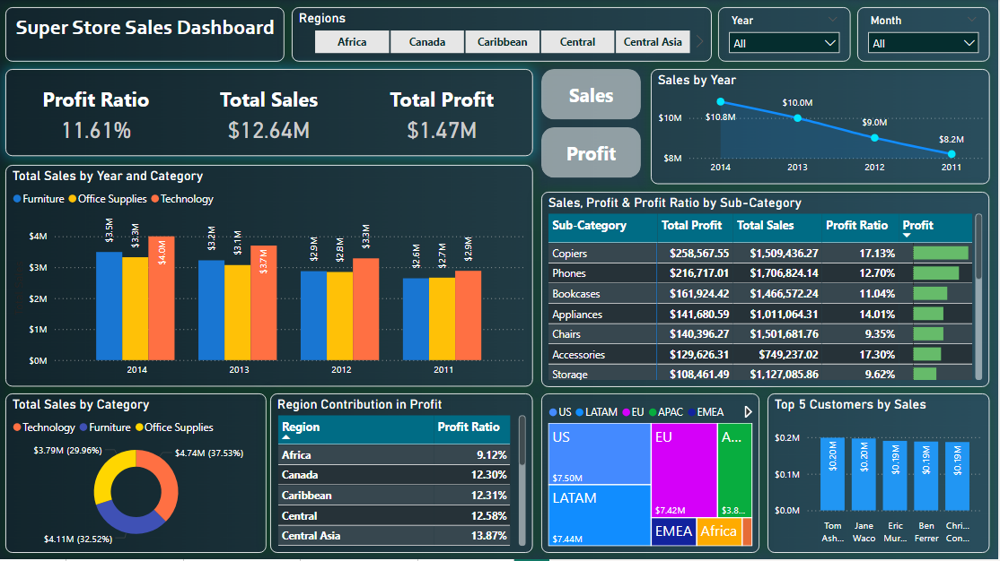
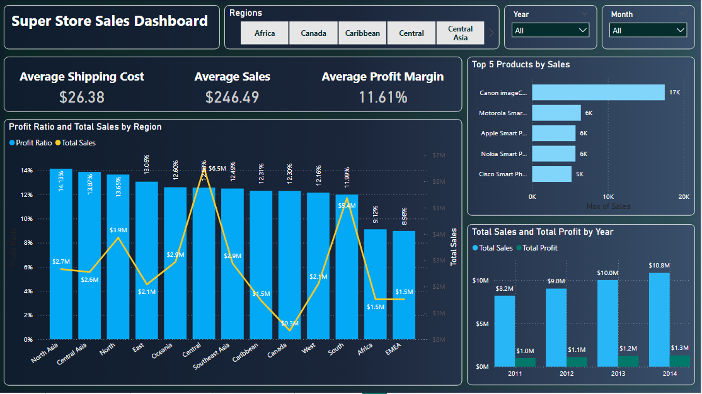
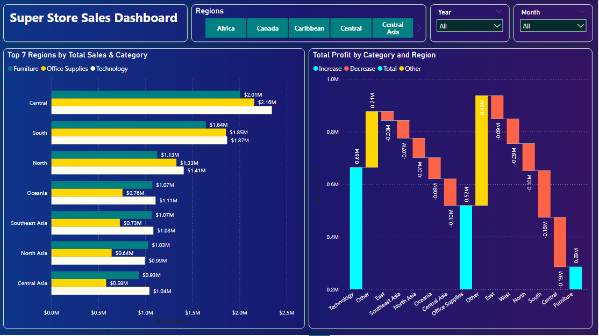
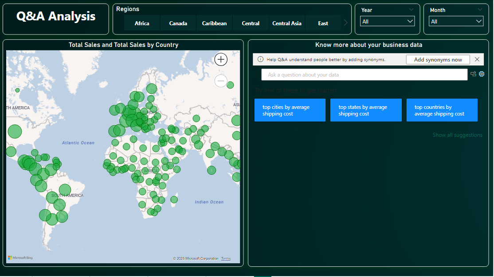

# Global Sales Performance Dashboard

This repository showcases an interactive **Global Sales Performance Dashboard** built using **Power BI**. The dashboard provides actionable insights into sales and profit performance across regions, products, and customers, empowering stakeholders to make informed decisions based on real-time analytics.

## Features

- **Sales and Profit Analysis**
  - Analyze total sales, profit, and profit ratios.
  - Compare Year-over-Year (YoY) growth trends.

- **Regional Insights**
  - Dynamic maps visualizing total sales by country and region.
  - Region-wise contribution to overall profit.

- **Product and Customer Performance**
  - Identify top-performing products and customers by sales.
  - Evaluate sales trends by product category.

- **Key Performance Indicators (KPIs)**
  - Custom KPIs such as:
    - Average Shipping Cost
    - Profit Margins
    - Sales Trends by Year and Category

- **Interactive Q&A Visual**
  - Empower stakeholders to derive custom analytics by asking natural language questions directly in the dashboard.

## Tools and Technologies

- **Power BI**: Primary tool for designing and visualizing data.
- **DAX (Data Analysis Expressions)**: For creating KPIs and custom calculations.
- **Power Query**: To transform and clean raw data.

## Key Visualizations

1. **Profit Ratio and YoY Growth**
2. **Region Contribution to Profit**
3. **Dynamic Maps**
   - Total Sales by Country
   - Regional Contributions
4. **Top Products and Customers by Sales**
5. **Custom KPIs and Sales Trends**

## How to Use

1. Open the Power BI file (`GlobalSalesPerformance.pbix`).
2. Connect to your data source (ensure proper access credentials and dataset format).
3. Explore various tabs and interactive elements of the dashboard.
4. Use the Q&A Visual to derive custom insights by typing questions in natural language.

## Data Requirements

- **Dataset Structure**:
  - **Sales Data**: Sales amount, date, and product details.
  - **Profit Data**: Profit values and related metrics.
  - **Customer Data**: Customer information including region.
  - **Shipping Data**: Shipping costs and methods.

## Insights Delivered

- Real-time insights into sales and profit trends.
- Region-wise performance analysis to target growth opportunities.
- Identification of high-performing products and customers.
- Custom analytics for quick decision-making.

## Dashboard Preview

- Sales Summary 1

- Sales Summary 2

- Sales Summary 3

- Sales Summary 4

- Q&A Analysis

---

### Contact
For further inquiries or support, feel free to reach out:

- **Email**: [sumitjadav1807@gmail.com](mailto:sumitjadav1807@gmail.com)
- **LinkedIn**: (https://www.linkedin.com/in/sumitjadav07/)
